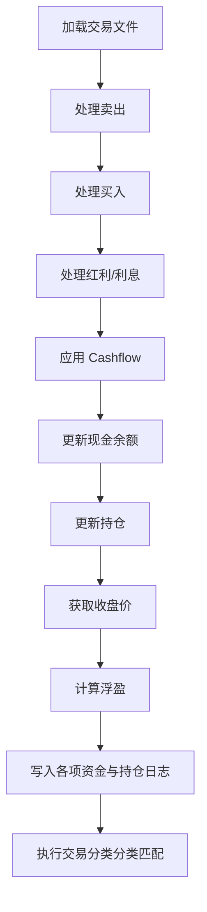

# Post-Trade 批量处理使用指南

## 概览

Post-Trade 命令统一处理三类互补的券商证据：交割单、委托和逐笔成交。默认 `--scope all`，既更新现金/持仓，也维护执行分析所需的原始委托/成交日志。

**本脚本与预测、融合、回测等模块完全解耦，不依赖任何模型输出。**

| 脚本 | 用途 |
|------|------|
| `prod_post_trade.py` | 批量处理交易日数据，更新持仓和资金 |
| `prod_post_trade_analytics.py` | 兼容入口，仅摄取委托和逐笔成交证据 |

### 数据权威边界

- `YYYY-MM-DD-table.xlsx`（每日 settlement），或通过 `--settlement-bundle` 显式选择的
  `YYYY-MM-DD-YYYY-MM-DD-table.xlsx`（区间 settlement），是现金、持仓、费用和红利的唯一权威来源。
- `YYYY-MM-DD-order.xlsx`（order）记录委托意图、成交率、撤单和状态。
- `YYYY-MM-DD-trade.xlsx`（trade）记录逐笔成交时间、数量和价格。

三者不能互相替代。执行质量分析依赖 order/trade；账户状态只允许 settlement 改变。

---

## 文件结构

```text
QuantPits/
├── quantpits/
│   ├── scripts/
│   │   └── prod_post_trade.py          # 本脚本
│   └── docs/
│       └── 04_POST_TRADE_GUIDE.md        # 本文档
│
└── workspaces/
    └── <YourWorkspace>/                  # 激活的隔离工作区
        ├── config/
            ├── prod_config.json        # 持仓/现金/处理状态
        │   └── cashflow.json             # 出入金记录
        └── data/
            ├── YYYY-MM-DD-table.xlsx     # 交易软件导出文件（每日一个，当前来源：国泰君安交割单脱敏导出）
            ├── YYYY-MM-DD-YYYY-MM-DD-table.xlsx # 可选区间交割文件；只有显式选择才会消费
            ├── YYYY-MM-DD-order.xlsx     # 委托证据
            ├── YYYY-MM-DD-trade.xlsx     # 逐笔成交证据
            ├── emp-table.xlsx            # 仅保留给旧 helper；主命令不再隐式回退
            ├── trade_log_full.csv        # 交易日志（累计）
            ├── trade_detail_YYYY-MM-DD.csv # 每日交易详情
            ├── trade_classification.csv  # 交易分类打标（累计：量化信号、替代、手工）
            ├── holding_log_full.csv      # 持仓日志（累计）
            ├── daily_amount_log_full.csv # 每日资金汇总（累计）
            ├── valuation_evidence.jsonl  # 估值来源、日期与价格口径证据
            ├── raw_order_log_full.csv    # 委托证据（累计）
            ├── raw_trade_log_full.csv    # 逐笔成交证据（累计）
            └── post_trade_ingestion_state.json # source fingerprint receipts
```

---

## Cashflow 配置

### 新格式（推荐）

`config/cashflow.json` 支持按日期指定多次出入金：

```json
{
    "cashflows": {
        "2026-02-03": 50000,
        "2026-02-06": -20000
    }
}
```

- **正数** = 入金（向账户转入资金）
- **负数** = 出金（从账户转出资金）
- 仅在对应日期的处理中生效

### 旧格式（向后兼容）

```json
{
    "cash_flow_today": 50000
}
```

旧格式会将全部金额应用到批次的**第一个交易日**。

### 处理后归档

真实 state/all 运行会在同一个可恢复本地事务中，仅归档本批次实际处理日期对应的 active cashflow。未来日期保持 active；显式零值也按“键存在”消费；`prod_config.json` 始终最后提交。

---

## 运行方式

```bash
cd QuantPits

# 正常运行：处理上次处理日到今天的所有交易日
python quantpits/scripts/prod_post_trade.py --scope all

# 轻量计划：不初始化 Qlib、不打开 Excel、不写文件
python quantpits/scripts/prod_post_trade.py --explain-plan
python quantpits/scripts/prod_post_trade.py --json-plan

# 指定券商进行处理 (默认读取 prod_config.json 中的配置，兜底为 gtja)
python quantpits/scripts/prod_post_trade.py --broker gtja

# 严格 dry-run：解析、对账、估值并计算完整状态，但不写文件
python quantpits/scripts/prod_post_trade.py --dry-run

# 明确只处理某一侧（计划会给出另一侧被跳过的 warning）
python quantpits/scripts/prod_post_trade.py --scope state
python quantpits/scripts/prod_post_trade.py --scope execution

# 指定结束日期
python quantpits/scripts/prod_post_trade.py --end-date 2026-02-10

# 显式选择一个覆盖完整 state 窗口的区间交割文件
python quantpits/scripts/prod_post_trade.py \
  --end-date 2026-02-06 \
  --settlement-bundle data/2026-02-03-2026-02-06-table.xlsx

# 详细输出：显示每笔交易明细
python quantpits/scripts/prod_post_trade.py --verbose

# 只读查看 transaction 状态
python quantpits/scripts/prod_post_trade.py --transaction-status

# 仅重试已提交 transaction 的分类步骤
python quantpits/scripts/prod_post_trade.py --retry-classification TRANSACTION_ID

# 执行但不写 RunManifest（OperatorLog 仍保留）
python quantpits/scripts/prod_post_trade.py --no-manifest
```

缺失交割单默认是错误，不再静默使用 `emp-table.xlsx`。确认某些交易日确实无活动时，可显式使用 `--allow-missing-settlement`；若 order/trade 已证明存在成交，该参数仍不能绕过一致性检查。

区间交割文件必须使用 workspace-relative 路径，并严格命名为
`YYYY-MM-DD-YYYY-MM-DD-table.xlsx`。程序只解析该物理文件一次，按规范化的 `交收日期` 在内存中形成
每日逻辑分区，不生成或覆盖每日 XLSX。显式选择后，它是本次命令唯一的 settlement 物理来源；同目录中的
每日交割文件仍保留，但不会被同时消费。文件名区间必须覆盖完整请求窗口，每行日期必须位于文件名区间、
请求窗口和解析后的交易日历内。文件中没有某交易日的行不等于观察到空日，仍须通过
`--allow-missing-settlement` 显式确认为 `assumed_empty`。

轻量 plan 记录一次区间文件的相对路径、SHA-256 和声明区间。严格 dry-run/真实执行增加每日
`observed`/`assumed_empty`、行数和逻辑 fingerprint，并在第一处 writer 前重新核对 workspace root、父目录、
设备/inode、大小、mtime 和 SHA-256。路径越界、符号链接逃逸、文件替换或改写都会 fail closed。

execution ingestion 使用 `post_trade_ingestion_state.json` 中的 source path + SHA-256 receipt，而不是最大日期游标，因此后到的旧日期文件仍会被发现。同一路径内容变化会 hard fail，避免更正文件与历史日志静默混合。

`--scope all` 使用两个独立窗口：settlement 只从 `prod_config.json` 的 state cursor 下一交易日开始，避免重复执行历史账户状态；order/trade 在未显式指定 `--start-date` 时扫描现存历史 export，并由 receipt 判断是否需要摄取。显式 `--start-date` 不允许早于 state cursor 的下一日；历史 state replay 需要后续专用 backfill 工具，不能借普通命令完成。

---

## 处理逻辑

对每个交易日，命令先构造不可变状态变化，再进入写盘阶段：



### 现金更新公式

```
cash_after = cash_before + 卖出收入 - 买入支出 + 红利利息 + cashflow
```

账户计算统一使用 `Decimal`。部分卖出按平均成本移除对应成本：持仓 100 股、成本 1000，卖出 40 股后剩余成本为 600，而不是用卖出回款直接冲减成本。红利税补缴等负现金调整也按实际 `资金发生数` 计入。

所有期末持仓和基准都必须有有效收盘价；缺失估值会在写盘前失败，不再静默丢失持仓或写入假的零基准。

账户估值会同时读取 `$close`、`$factor` 和 `Div($close,$factor)`。持仓证券会验证 close/factor 派生关系；指数基准保留三字段但按 provider-reported 口径记录，不把个股 factor 公式强加给指数。未来真实 state transaction 会把原始字段、factor、派生价格、用途和价格口径写入 `data/valuation_evidence.jsonl`。该 sidecar 与状态日志一起恢复提交，位于 daily log 之后、cashflow 与 cursor 之前；旧 CSV schema 不变。

### 估值日期与券商资产快照

估值证据严格区分 `market_date`（价格对应日期）、`observed_at`（查询/导出时间）和 `effective_date`（账户状态日期）。券商周末资产快照可能提前展示除权/除息价格，因此不能覆盖上一个交易日的 Qlib 历史收盘价，也不能通过减去每股红利构造替代价。资产快照是独立观察通道，不属于 settlement/order/trade intake，不推进 cursor。

默认只读对账示例：

```bash
python -m quantpits.tools.reconcile_post_trade_account \
  --workspace workspaces/Demo_Workspace \
  --broker gtja --snapshot-file data/example-asset.xlsx \
  --account-date 2026-01-09 \
  --snapshot-effective-date 2026-01-09 \
  --snapshot-market-date 2026-01-09 --json
```

不传 `--write-report` 时只输出 stdout。日期或价格口径不可比时返回退出码 2，不生成部分账户 NAV，也不修改历史状态。公共结果不包含账户号、姓名、营业部、股东账号或原始备注。

### 数据文件说明

| 文件 | 内容 | 更新方式 |
|------|------|----------|
| `trade_log_full.csv` | 全部交易记录 | 按处理日期确定性替换 |
| `trade_classification.csv` | 核心量化/手工买卖归因打标 | 自动依赖建议文件推算 |
| `holding_log_full.csv` | 每日持仓快照 | 按处理日期确定性替换 |
| `daily_amount_log_full.csv` | 每日资金汇总 | 每日一行、按日期替换 |
| `valuation_evidence.jsonl` | 估值 provenance sidecar | 按市场日期替换并事务提交 |
| `trade_detail_*.csv` | 单日交易详情 | 每日覆写 |

### 券商交割单适配器 (Broker Adapter)

系统采用 **Broker Adapter** 架构处理不同券商由于导出的 Excel/CSV 表头和格式不同的问题。核心处理逻辑要求内部有一套标准化 Schema（包含 `证券代码`, `交易类别`, `资金发生数` 等标准中文字段）。

**内置适配器 (`brokers/`)：**
* `gtja`: 国泰君安交割单适配器（默认）。它负责处理前5行无用表头、剥离内部字符串的 `\t`，并直接沿用了原有的中文字段。

如果你需要接入新的券商，只需：
1. 在 `quantpits/scripts/brokers/` 下创建一个继承自 `BaseBrokerAdapter` 的新适配器类。
2. 实现 strict `parse_settlement` / `parse_orders` / `parse_trades`，将券商格式映射成标准 DataFrame；缺文件、解析失败和 schema 错误必须抛出 typed error。兼容 `read_*` 方法可保留 warning + empty 行为。
3. 在 `brokers/__init__.py` 的 `BROKER_REGISTRY` 中注册你的适配器。
4. 运行时加上 `--broker your_broker_name` 或在 `prod_config.json` 中配置 `"broker": "your_broker_name"`。

---

## 典型工作流

### 场景 1：例行处理

```bash
# 1. 将交易软件导出文件放入 data/ 目录，命名为 YYYY-MM-DD-table.xlsx
# 2. 如有出入金，编辑 config/cashflow.json
# 3. 运行脚本
python quantpits/scripts/prod_post_trade.py
```

### 场景 2：两次处理之间有多次出入金

```bash
# 编辑 cashflow.json，按日期填写每次出入金
cat config/cashflow.json
# {"cashflows": {"2026-02-03": 50000, "2026-02-06": -20000}}

# 预览确认
python quantpits/scripts/prod_post_trade.py --dry-run

# 确认无误后执行
python quantpits/scripts/prod_post_trade.py
```

### 场景 3：先预览再执行

```bash
# 严格预检：会打开并校验 Excel，但不写文件
python quantpits/scripts/prod_post_trade.py --dry-run

# 只查看轻量计划（不打开 Excel）
python quantpits/scripts/prod_post_trade.py --explain-plan

# 确认后实际运行
python quantpits/scripts/prod_post_trade.py
```

---

## 完整参数一览

```
python quantpits/scripts/prod_post_trade.py --help

可选参数:
  --scope {all,state,execution}
  --start-date TEXT 起始日期；state/all 不得早于 state cursor 的下一日
  --end-date TEXT   结束日期 (YYYY-MM-DD)，默认为今天
  --allow-missing-settlement  显式确认缺失交割单的日期无活动
  --settlement-bundle PATH  显式选择一个 YYYY-MM-DD-YYYY-MM-DD-table.xlsx 区间交割文件
  --dry-run         完整解析、对账、估值和状态计算，不写入任何文件
  --explain-plan    轻量文本计划；不初始化 Qlib、不打开 Excel
  --json-plan       轻量 JSON 计划；stdout 只输出一个 JSON payload
  --broker TEXT     券商标识 (默认优先读取 prod_config.json 中的 broker，兜底为 gtja)
  --run-id TEXT     可选运行标识，不影响语义 fingerprint
  --verbose         详细输出每日交易明细
```

---

## 注意事项

> [!IMPORTANT]
> 本脚本**仅处理实盘交易数据**，与训练 (`static_train.py --full`)、预测 (`static_train.py --predict-only`)、回测 (`brute_force_ensemble.py`) 等模块完全独立，互不耦合。

> [!TIP]
> 建议先用 `--explain-plan` 查看轻量计划，再用 `--dry-run` 完成严格输入预检。`--dry-run` 不创建锁或任何文件；若发现未完成 transaction，会拒绝重新计算并要求先恢复。

> [!WARNING]
> 每日三类文件必须严格命名为 `YYYY-MM-DD-table.xlsx`、`YYYY-MM-DD-order.xlsx`、`YYYY-MM-DD-trade.xlsx`；
> 显式区间交割文件必须命名为 `YYYY-MM-DD-YYYY-MM-DD-table.xlsx`。缺失 settlement 默认失败，不会隐式
> 使用空模板；只有显式 `--allow-missing-settlement` 才能确认无活动。

> [!WARNING]
### 可恢复事务与运行审计

账户状态使用 workspace-local transaction journal：所有目标 bytes 先写入 `data/.post_trade_transactions/<run_id>/staged/`，journal 持久化后才替换目标。每个 artifact 都记录 baseline/target SHA-256；恢复只接受当前内容等于 baseline 或 target，第三版本会进入 `conflicted`，不会覆盖人工修改。`cashflow.json` 在派生日志之后提交，`prod_config.json` 始终最后提交。

这是一套单 workspace、本地文件系统的可恢复协议，不是分布式事务。execution ingestion 仍有独立 receipt 提交域；RunManifest 会分别记录 execution、state transaction 和 classification 状态。journal 同时保留 light plan、严格解析/估值后的 resolved execution，以及实际 classification 输出的 SHA-256 fingerprint。真实运行默认写 `output/manifests/post-trade/<run_id>.json` 与 `data/operator_log.jsonl`，公开审计信息只包含日期范围、计数、相对路径和 fingerprint，不包含账户金额、持仓、券商原始行或本机绝对路径。

中断处理：

1. 不要手工编辑 `prod_config.json`、`cashflow.json` 或状态日志；
2. 运行 `--transaction-status`；
3. `prepared/committing` 可通过再次运行正常命令恢复；若 state 已提交但 classification 仍为 `pending/running`，同一恢复流程会先校验全部 target fingerprint，再继续 classification 与审计闭环；
4. `conflicted` 必须停止并检查 fingerprint，不能强制覆盖；
5. state 已提交但 classification 失败时，使用 `--retry-classification TRANSACTION_ID`。
