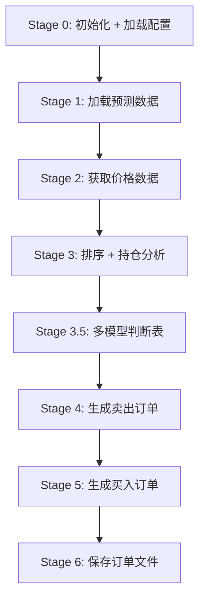

# 订单生成使用指南

## 概览

`scripts/order_gen.py` 用于基于融合/单模型预测生成买卖订单建议。

**本脚本是工作流的最后一步**，需要在有预测数据且处理完交易实际情况后运行。

**工作流位置**: 训练 → 穷举 → 融合回测 → Post-Trade → **订单生成（本步）**

| 脚本 | 用途 |
|------|------|
| `order_gen.py` | 基于预测结果 + 当前持仓，生成买卖订单 CSV |

---

## 快速开始

```bash
cd QuantPits

# 1. 使用 ensemble 融合预测（最常用）
python quantpits/scripts/order_gen.py

# 2. 使用单模型预测（不融合）
python quantpits/scripts/order_gen.py --model gru

# 3. 先预览，不写入文件
python quantpits/scripts/order_gen.py --dry-run

# 4. 查看详细排名 + 多模型判断
python quantpits/scripts/order_gen.py --verbose
```

---

## 预测数据来源

脚本支持三种预测来源，按优先级：

| 优先级 | 参数 | 来源 | 说明 |
|:---:|------|------|------|
| 1 | `--prediction-file` | 任意 CSV | 直接指定预测文件路径 |
| 2 | `--model` | 单模型 CSV | 从 `output/predictions/{model}_*.csv` 加载最新 |
| 3 | _(默认)_ | Ensemble CSV | 优先 `ensemble_YYYY-MM-DD.csv` (default combo 副本)，次选 `ensemble_default_*.csv`，最后任意 `ensemble_*.csv` |

### 使用单模型（不融合）

```bash
# 只用 gru 模型的预测
python quantpits/scripts/order_gen.py --model gru

# 只用 lightgbm 模型的预测
python quantpits/scripts/order_gen.py --model lightgbm_Alpha158
```

### 指定预测文件

```bash
python quantpits/scripts/order_gen.py --prediction-file output/predictions/ensemble_2026-02-06.csv
```

---

## 处理逻辑



### 锚点日期

脚本自动使用 Qlib 日历中**最近的前一交易日**作为锚点日期，与训练脚本逻辑一致。

### 持仓分析逻辑

1. 按 `score` 降序排名所有标的
2. 取 TopK + DropN × 买入倍数 作为候选池
3. 当前持仓在候选池内的 → **继续持有**
4. 当前持仓不在候选池内的，取排名最低的 DropN 个 → **卖出**
5. 候选池中不在持有列表里的 → **买入候选**

### 多模型判断表 (Stage 3.5)

**新增功能**：自动加载所有 combo 和单一模型的预测，对关注标的（持仓 + 候选）给出各预测源的 BUY/SELL/HOLD 判断。

判断逻辑（与 Stage 3 持仓分析完全一致）：
- **order_basis**: 使用 Stage 1 加载的同一份预测（经 price merge），与实际订单 **100% 一致**
- **combo_*/model_***: 各预测源独立模拟换仓决策

判断符号：
- **HOLD**: 持仓在候选池内，或池外但非最差 DropN
- **SELL**: 持仓在候选池外，且为最差 DropN
- **BUY**: 非持仓，排名靠前的买入候选（数量 = 卖出数）
- **BUY***: 非持仓，备选买入（应对停牌等）
- **--**: 非持仓，不在买入候选范围

输出包含：
- `model_opinions_{date}.csv` — 每行一个标的，每列一个预测源的判断
- `model_opinions_{date}.json` — combo 组成信息 + 模型参与关系 + 判断图例

使用 `--verbose` 在终端查看判断表：
```bash
python quantpits/scripts/order_gen.py --verbose --dry-run
```

#### 可视化模型排名

可使用 `plot_model_opinions.py` 快速绘制出各标的在各个模型中的排名折线图：
```bash
python quantpits/scripts/plot_model_opinions.py
# 默认自动查找最新生成的 csv，或指定文件：--input output/model_opinions_2026-02-24.csv
```

### 资金计算

```
可用现金 = 当前余额 + 预估卖出回收 + 当日出入金
每股预算 = 可用现金 / 需要买入数量
买入手数 = floor(每股预算 / 涨停估价 / 100) × 100
```

---

## 输出文件

```
output/
├── sell_suggestion_{source}_{date}.csv       # 卖出订单
├── buy_suggestion_{source}_{date}.csv        # 买入订单
├── model_opinions_{date}.csv                 # 多模型判断表
└── model_opinions_{date}.json                # 模型组成信息
```

其中 `{source}` 为 `ensemble`、模型名（如 `gru`）或 `custom`。

### 订单字段

| 字段 | 说明 |
|------|------|
| `instrument` | 标的代码 |
| `datetime` | 交易日期 |
| `value` | 数量（股） |
| `estimated_amount` | 预估金额 |
| `score` | 预测分数 |
| `current_close` | 当前复权收盘价 |

### 多模型判断表字段

| 字段 | 说明 |
|------|------|
| `instrument` | 标的代码（index） |
| `order_basis` | 与实际订单一致的 BUY/SELL/HOLD 判断 |
| `combo_{name}` | 每个 combo 的 BUY/SELL/HOLD 判断 |
| `model_{name}` | 每个单一模型的 BUY/SELL/HOLD 判断 |

---

## 完整参数一览

```
python quantpits/scripts/order_gen.py --help

可选参数:
  --model TEXT             使用单模型预测（不融合）
  --prediction-file TEXT   直接指定预测文件路径
  --output-dir TEXT        输出目录 (默认 output)
  --dry-run               仅打印订单计划，不写入文件
  --verbose               显示详细的排名和价格信息
```

---

## 典型工作流

### 场景 1：完整例行流程

```bash
# Step 1: 训练 / 预测
python quantpits/scripts/prod_train_predict.py

# Step 2: 穷举组合
python quantpits/scripts/brute_force_fast.py --max-combo-size 3

# Step 3: 融合回测（所有 combo）
python quantpits/scripts/ensemble_fusion.py --from-config-all

# Step 4: 处理上周交易（如有）
python quantpits/scripts/prod_post_trade.py

# Step 5: 生成订单
python quantpits/scripts/order_gen.py

# Step 6: 生成信号排名（分享用）
python quantpits/scripts/signal_ranking.py --all-combos
```

### 场景 2：只用单模型

```bash
# 用 gru 模型预测直接生成订单
python quantpits/scripts/order_gen.py --model gru
```

### 场景 3：先预览再生成

```bash
# 预览订单 + 查看多模型判断
python quantpits/scripts/order_gen.py --dry-run --verbose

# 确认无误后正式生成
python quantpits/scripts/order_gen.py
```

---

## 前置条件

> [!IMPORTANT]
> 本脚本需要以下前置条件：
> 1. `output/predictions/` 中存在预测文件（来自训练/融合脚本）
> 2. `config/prod_config.json` 中的持仓和现金已更新（来自 post-trade 脚本）

> [!TIP]
> 建议在正式运行前先用 `--dry-run --verbose` 确认订单计划。

---

## 与其他脚本的关系

| 脚本 | 用途 | 输入 | 输出 |
|------|------|------|------|
| `prod_train_predict.py` | 训练模型 | configs | `latest_train_records.json` |
| `brute_force_fast.py` | 穷举组合 | train records | leaderboard |
| `ensemble_fusion.py` | 融合回测 | 选定模型 | 融合预测 + 绩效 |
| `prod_post_trade.py` | 处理交易 | 交易文件 | 更新持仓/现金 |
| `signal_ranking.py` | 信号排名 | 融合预测 | Top N 排名 CSV |
| **`order_gen.py`** | **生成订单** | **预测 + 持仓** | **买卖建议 + 多模型判断** |
