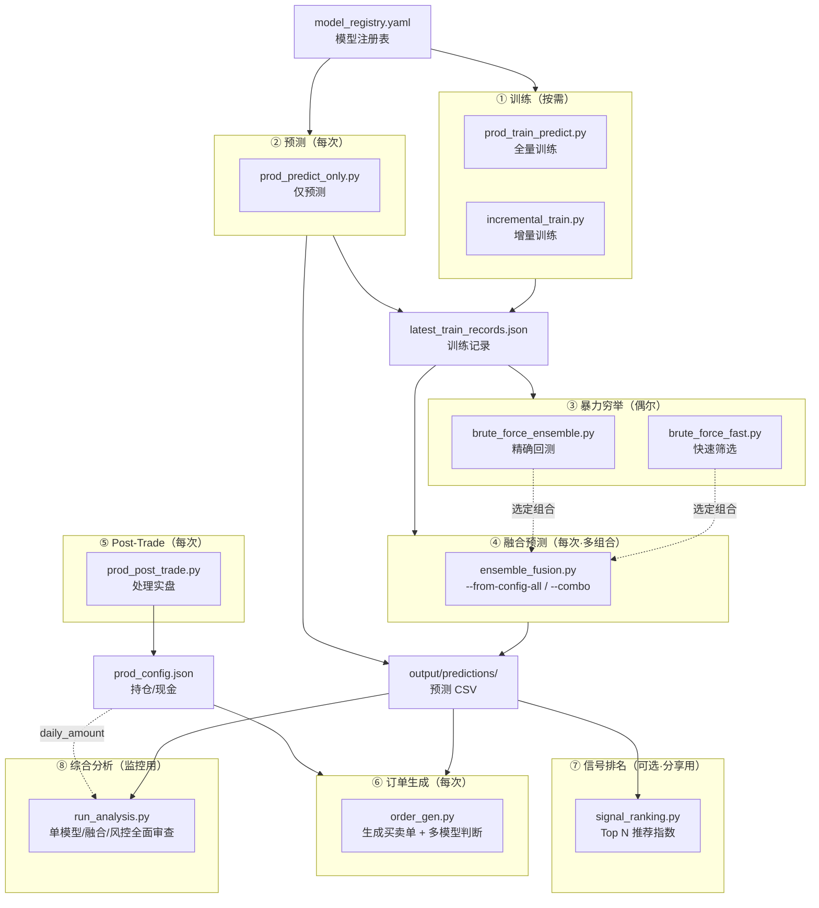

# QuantPits 量化交易系统总览

## 系统定位

基于 Qlib 的**各频次量化交易生产系统**（支持周频/日频），采用"多模型训练 → 组合优选 → 融合预测 → 订单生成"的流水线架构。

---

## 工作区 (Workspace) 架构

系统严格区分了 **Engine (代码)** 和 **Workspace (数据与配置)**，实现多实例并行：
- **Engine (`engine/`)**: 存放被全局共用的所有核心脚本（`scripts/`）、分析面板（`dashboard.py`）及系统文档（`docs/`）。
- **Workspace (`workspaces/` 下目录)**: 任何进行实盘交易或模拟的独立集合。包含了该实例独有的 `config/`、`data/`、`output/`，以及隔离的 `mlruns/`。

**如何使用工作区？**
1. 创建新工作区：使用 `python engine/scripts/init_workspace.py --source workspaces/A --target workspaces/B` 快速搭建。
2. 激活工作区：进入系统目录，`source workspaces/<你的工作区>/run_env.sh` 设置 `QLIB_WORKSPACE_DIR`。
3. 执行脚本：脚本会自动将所有的文件读写路由到当前激活的工作区内部。
   > [!IMPORTANT]
   > **初始化顺序**：所有核心脚本必须在开头首先执行 `import env`。这会确保 `ROOT_DIR` 被正确识别，并且 `MLFLOW_TRACKING_URI` 指向工作区内部的 `mlruns/` 目录。

---

## 核心设计理念

本系统的每一步都是**可选、可组合**的。只有"预测"和"订单生成"是例行操作，其余步骤根据需要触发：

| 步骤 | 是否每次都做 | 说明 |
|------|:---:|------|
| ① 训练 | ⚠️ 至少一次 | 首次必须训练；后续仅在需要刷新模型时重训 |
| ② 预测 | ✅ 每次 | 可随训练一起产出，也可用已有模型单独预测 |
| ③ 暴力穷举 | ❌ 偶尔 | 非常耗时，选好的组合可持续使用一段时间 |
| ④ 融合预测 | ✅ 每次 | 支持多组合融合和对比，用选定组合生成最终融合信号 |
| ⑤ Post-Trade | ✅ 每次 | 处理上周期实盘数据,更新持仓和资金 |
| ⑥ 订单生成 | ✅ 每次 | 基于融合预测和当前持仓,输出买卖建议 + 多模型判断 |
| ⑦ 信号排名 | 可选 | 归一化分数生成 Top N 排名，适合分享 |

> [!IMPORTANT]
> 训练不必每周都做，但预测每次必须。穷举组合是"重资产"操作，选定的模型组合可以用很久。日常操作的最小闭环是：**预测 → 融合 → Post-Trade → 订单生成**。

---

## 系统架构



---

## 典型运行场景

⚠️ **以下所有场景均需在系统根目录（`QuantPits`）下操作，并已提前激活对应的工作区。**
```bash
cd QuantPits
source workspaces/Demo_Workspace/run_env.sh
```

### 场景 A：完整生产例行流程（含训练）

适用于首次运行或需要刷新模型的周期。

```bash
# ① 全量训练（产出预测 + 训练记录）
python engine/scripts/prod_train_predict.py

# ③ 暴力穷举找组合（可选，非常耗时）
python engine/scripts/brute_force_fast.py --max-combo-size 3

# ④ 融合预测（用选定组合）
python engine/scripts/ensemble_fusion.py \
  --models gru,linear_Alpha158,alstm_Alpha158

# ⑤ 处理上周实盘交易
python engine/scripts/prod_post_trade.py

# ⑥ 生成本周订单
python engine/scripts/order_gen.py
```

### 场景 B：常规流程（不重训，最小闭环）

适用于已有可用模型，数据更新后直接预测。**这是最常见的生产流程。**

```bash
# ② 用已有模型预测新数据
python engine/scripts/prod_predict_only.py --all-enabled

# ④ 融合预测（多组合对比）
python engine/scripts/ensemble_fusion.py --from-config-all

# ⑤ 处理上周实盘交易
python engine/scripts/prod_post_trade.py

# ⑥ 生成本周订单
python engine/scripts/order_gen.py

# ⑦ 生成信号排名（可选，分享用）
python engine/scripts/signal_ranking.py --all-combos

# ⑧ 综合分析系统健康度（可选，监控用）
python engine/scripts/run_analysis.py \
  --models gru_Alpha158 transformer_Alpha360 TabNet_Alpha158 sfm_Alpha360
```

### 场景 C：融合效果不佳，回退重训

融合预测质量下降时，重训个别模型并重新评估。

```bash
# ① 增量训练某些模型
python engine/scripts/incremental_train.py --models gru,alstm_Alpha158

# ④ 用新模型重新融合
python engine/scripts/ensemble_fusion.py \
  --models gru,linear_Alpha158,alstm_Alpha158

# ⑤⑥ Post-Trade + 订单生成（同场景 B）
python engine/scripts/prod_post_trade.py
python engine/scripts/order_gen.py
```

### 场景 D：重新评估模型组合

定期或发现组合不合适时重新穷举。

```bash
# ② 用已有模型预测（或训练后自动产出）
python engine/scripts/prod_predict_only.py --all-enabled

# ③ 快速穷举
python engine/scripts/brute_force_fast.py --max-combo-size 5

# ③ 对 Top 候选精确回测确认
python engine/scripts/brute_force_ensemble.py \
  --min-combo-size 3 --max-combo-size 3

# ④ 选新组合融合
python engine/scripts/ensemble_fusion.py \
  --models <新选定组合>

# ⑤⑥ 同上
```

---

## 模块速查

### ① 训练模块

> 详见 [01_TRAINING_GUIDE.md](01_TRAINING_GUIDE.md)

| 脚本 | 用途 | 保存语义 |
|------|------|----------|
| `prod_train_predict.py` | 全量训练所有 enabled 模型 | **全量覆写** `latest_train_records.json` |
| `incremental_train.py` | 按名称/算法/标签等选择性训练 | **增量合并** `latest_train_records.json` |

- 模型通过 `config/model_registry.yaml` 统一注册管理
- 日期参数及频次（`week`/`day`）由 `config/model_config.json` 控制
- 训练记录修改前自动备份到 `data/history/`
- 增量训练支持 `--resume`（断点续训）和 `--dry-run`（预览）

### ② 预测模块

> 详见 [05_PREDICT_ONLY_GUIDE.md](05_PREDICT_ONLY_GUIDE.md)

| 脚本 | 用途 |
|------|------|
| `prod_predict_only.py` | 用已有模型对新数据预测，不重训 |

- 从 `latest_train_records.json` 加载模型，创建新 Recorder 保存预测
- 支持与训练脚本相同的模型选择方式（按名称/算法/标签等）
- **增量合并**更新 `latest_train_records.json`，下游脚本无感知切换

### ③ 暴力穷举模块

> 详见 [02_BRUTE_FORCE_GUIDE.md](02_BRUTE_FORCE_GUIDE.md)

| 脚本 | 用途 | 速度 |
|------|------|------|
| `brute_force_fast.py` | 向量化快速筛选 | ~0.001s/组合 |
| `brute_force_ensemble.py` | Qlib 完整回测 | ~5s/组合 |

- **推荐工作流**：先用快速版粗筛所有组合，再用原版精确验证 Top 候选
- 输出模型归因分析、风险收益散点图、层次聚类等
- 支持 `--resume` 断点续跑和 `--analysis-only` 仅分析

### ④ 融合预测模块

> 详见 [03_ENSEMBLE_FUSION_GUIDE.md](03_ENSEMBLE_FUSION_GUIDE.md)

| 脚本 | 用途 |
|------|------|
| `ensemble_fusion.py` | 对选定模型组合进行融合+回测+风险分析 |

- 支持多组合融合：`--from-config-all` 一次运行所有 combo，`--combo` 指定单个
- 多组合模式生成跨组合对比表和净值对比图
- 权重模式：`equal`（等权）/ `icir_weighted` / `manual` / `dynamic`
- 输出融合预测 CSV 到 `output/predictions/ensemble_*.csv`
- 配置文件：`config/ensemble_config.json`（多 combo 结构，兼容旧格式）

### ⑤ Post-Trade 模块

> 详见 [04_POST_TRADE_GUIDE.md](04_POST_TRADE_GUIDE.md)

| 脚本 | 用途 |
|------|------|
| `prod_post_trade.py` | 处理实盘交易数据，更新持仓和资金 |

- **完全独立**于训练/预测/融合模块
- 从交易软件导出文件(`.xlsx`)读取成交记录
- 支持按日期指定多次出入金（`config/cashflow.json`）
- 更新 `config/prod_config.json` 中的持仓和现金余额

### ⑥ 订单生成模块

> 详见 [06_ORDER_GEN_GUIDE.md](06_ORDER_GEN_GUIDE.md)

| 脚本 | 用途 |
|------|------|
| `order_gen.py` | 基于预测 + 当前持仓，生成买卖订单 CSV |

- 支持三种预测来源：ensemble 融合（默认）/ 单模型 / 自定义文件
- **多模型判断表**：自动加载所有 combo 和单一模型的预测，对每个标的生成 BUY/SELL/HOLD 判断
- 附带可视化脚本 `plot_model_opinions.py` 生成多模型排名折线图
- 依赖 `prod_config.json` 中的持仓和现金（来自 Post-Trade）
- TopK + DropN 策略决定买入/卖出/持有

### ⑦ 信号排名模块

> 详见 [07_SIGNAL_RANKING_GUIDE.md](07_SIGNAL_RANKING_GUIDE.md)

| 脚本 | 用途 |
|------|------|
| `signal_ranking.py` | 将融合分数归一化为推荐指数，生成 Top N 排名 |

- 归一化分数到 -100 ~ +100 的推荐指数
- 支持按 combo 组合生成（`--all-combos` / `--combo`）
- 独立于订单生成，适合分享给他人

---

## 数据流向

```
┌─────────────────────────────────────────────────────────────────┐
│                      配置层                                      │
│  model_registry.yaml    model_config.json    prod_config.json    │
│  cashflow.json          ensemble_config.json                     │
└────────────┬──────────────────┬──────────────────┬──────────────┘
             │                  │                  │
             ▼                  ▼                  ▼
┌──────────────────┐  ┌──────────────────┐  ┌──────────────────┐
│ 训练 / 预测      │  │ 实盘数据处理      │  │ 出入金            │
│ (train/predict)  │  │ (post-trade)     │  │ (cashflow.json)  │
└────────┬─────────┘  └────────┬─────────┘  └────────┬─────────┘
         │                     │                     │
         ▼                     ▼                     ▼
  latest_train_records.json    prod_config.json (持仓/现金更新)
         │                             │
         ▼                             │
  ┌──────────────────┐                 │
  │ 暴力穷举（可选）   │                 │
  │ brute_force_*.py │                 │
  └────────┬─────────┘                 │
           │ 选定组合                   │
           ▼                           │
  ┌──────────────────┐                 │
  │ 融合预测          │                 │
  │ ensemble_fusion  │                 │
  └────────┬─────────┘                 │
           │ ensemble_*.csv            │
           ▼                           ▼
  ┌────────────────────────────────────────┐
  │ 订单生成                                │
  │ order_gen.py                           │
  │ 输入: 预测CSV + 持仓/现金               │
  │ 输出: buy/sell_suggestion_*.csv        │
  └────────────────────────────────────────┘
```

---

## 关键文件说明

### 配置文件 (`config/`)

| 文件 | 用途 | 相关模块 |
|------|------|----------|
| `model_registry.yaml` | 模型注册表：定义模型名、算法、数据集、标签 | 训练、预测 |
| `model_config.json` | 日期参数：训练窗口、滑动/固定模式 | 训练、预测 |
| `prod_config.json` | 实盘状态：当前持仓、现金余额、处理日期 | Post-Trade、订单生成 |
| `cashflow.json` | 出入金记录：按日期的出入金 | Post-Trade |
| `ensemble_config.json` | 多组合融合配置：combo 定义、权重、default | 融合预测、订单生成、信号排名 |
| `workflow_config_*.yaml` | Qlib 工作流：各模型的训练配置 | 训练 |

### 输出文件 (`output/`)

| 目录/文件 | 用途 |
|-----------|------|
| `predictions/*.csv` | 各模型和 ensemble 的预测结果（多 combo 带组合名） |
| `brute_force/` | 暴力穷举精确回测结果和分析报告 |
| `brute_force_fast/` | 快速穷举结果 |
| `ensemble/` | 融合配置、排行榜、图表、跨组合对比 |
| `ranking/` | 信号排名 Top N CSV |
| `model_opinions_*.csv/json` | 多模型 BUY/SELL/HOLD 判断表 |
| `model_opinions_*_linechart.png` | 多模型排名可视化折线图 |
| `buy/sell_suggestion_*.csv` | 买卖订单 |
| `model_performance_*.json` | 模型 IC/ICIR 指标 |

### 运行状态 (`data/`)

| 文件 | 用途 |
|------|------|
| `history/` | 自动备份的历史文件 |
| `order_history/` | 历史订单建议、交易明细、交易软件导出表（由归档脚本管理） |
| `run_state.json` | 增量训练运行状态（支持断点续跑） |
| `trade_log_full.csv` | 累计交易日志（含买入和卖出） |
| `holding_log_full.csv` | 累计持仓日志 |
| `daily_amount_log_full.csv` | 每日资金汇总 |

### 归档目录 (`archive/`)

| 目录 | 用途 |
|------|------|
| `output/` | 历史输出文件（predictions、ensemble、brute_force 等的旧版本） |

---

## 文档索引

| 编号 | 文档 | 内容 |
|:---:|------|------|
| 00 | [本文档](00_SYSTEM_OVERVIEW.md) | 系统总览、架构、典型场景、模块速查 |
| 01 | [TRAINING_GUIDE](01_TRAINING_GUIDE.md) | 全量训练、增量训练、模型注册表管理 |
| 02 | [BRUTE_FORCE_GUIDE](02_BRUTE_FORCE_GUIDE.md) | 暴力穷举组合回测（原版 + 快速版） |
| 03 | [ENSEMBLE_FUSION_GUIDE](03_ENSEMBLE_FUSION_GUIDE.md) | 模型融合预测、权重模式、回测 |
| 04 | [POST_TRADE_GUIDE](04_POST_TRADE_GUIDE.md) | 实盘交易数据处理、持仓/资金更新 |
| 05 | [PREDICT_ONLY_GUIDE](05_PREDICT_ONLY_GUIDE.md) | 仅预测（不重训）、更新训练记录 |
| 06 | [ORDER_GEN_GUIDE](06_ORDER_GEN_GUIDE.md) | 订单生成、买卖建议输出 |
| 07 | [SIGNAL_RANKING_GUIDE](07_SIGNAL_RANKING_GUIDE.md) | 信号排名 Top N 推荐 |
| 08 | [ANALYSIS_GUIDE](08_ANALYSIS_GUIDE.md) | 单模型质量、融合相关性、执行滑点成本及多维组合风险综合评测 |

---

## 共享工具模块

`scripts/train_utils.py` 提供训练和预测模块的公共能力：

- **日期计算**：基于 Qlib 日历的锚点日期、窗口计算
- **YAML 注入**：将日期参数注入 Qlib 工作流配置
- **模型注册表**：加载和筛选 `model_registry.yaml`
- **历史备份**：自动备份关键文件到 `data/history/`
- **记录合并**：Merge 语义更新 `latest_train_records.json`

### ⑧ 文件归档工具

| 脚本 | 用途 |
|------|------|
| `archive_dated_files.py` | 归档历史带日期文件，保留最新 N 个版本 |

- 自动扫描 `output/` 和 `data/` 中的带日期文件，按逻辑名分组
- 交易数据（订单建议、交易明细、xlsx）归档到 `data/order_history/`
- 输出文件旧版本归档到 `archive/output/`
- 支持 `--dry-run`、`--keep N`、`--include-notebooks`、`--cleanup-legacy`
- **常态化使用**：每个分析周期运行后执行 `python engine/scripts/archive_dated_files.py` 即可
- **模型加载**：从 Qlib Recorder 加载模型和预测

---

## 决策参考

### 什么时候需要重新训练？

- 模型预测质量明显下降（IC/ICIR 衰减）
- 市场风格发生重大转变
- 新增了模型需要首次训练
- 调参后需要验证效果

### 什么时候需要重新穷举？

- 新增或移除了模型
- 重训后模型预测特性大幅变化
- 当前组合连续多周表现不佳
- 定期审查（如每月一次）

### 日常最小操作是什么？

```bash
# 每周最小闭环（4 条命令，假设 workspace 已激活）
python engine/scripts/prod_predict_only.py --all-enabled     # 预测
python engine/scripts/ensemble_fusion.py --from-config-all       # 融合
python engine/scripts/prod_post_trade.py                      # Post-Trade
python engine/scripts/order_gen.py                              # 生成订单
```
