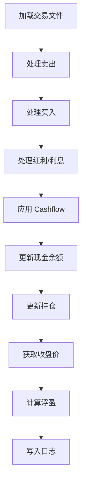

# Post-Trade 批量处理使用指南

## 概览

Post-Trade 脚本用于处理实盘交易数据：从交易软件导出文件中读取成交记录，更新持仓、现金余额和日志。

**本脚本与预测、融合、回测等模块完全解耦，不依赖任何模型输出。**

| 脚本 | 用途 |
|------|------|
| `weekly_post_trade.py` | 批量处理交易日数据，更新持仓和资金 |

---

## 文件结构

```text
QuantPits/
├── engine/
│   ├── scripts/
│   │   └── weekly_post_trade.py          # 本脚本
│   └── docs/
│       └── 04_POST_TRADE_GUIDE.md        # 本文档
│
└── workspaces/
    └── <YourWorkspace>/                  # 激活的隔离工作区
        ├── config/
        │   ├── weekly_config.json        # 持仓/现金/处理状态
        │   └── cashflow.json             # 出入金记录
        └── data/
            ├── YYYY-MM-DD-table.xlsx     # 交易软件导出文件（每日一个）
            ├── emp-table.xlsx            # 空模板（无交易日使用）
            ├── trade_log_full.csv        # 交易日志（累计）
            ├── trade_detail_YYYY-MM-DD.csv # 每日交易详情
            ├── holding_log_full.csv      # 持仓日志（累计）
            └── daily_amount_log_full.csv # 每日资金汇总（累计）
```

---

## Cashflow 配置

### 新格式（推荐）

`config/cashflow.json` 支持按日期指定多次出入金：

```json
{
    "cashflows": {
        "2026-02-03": 50000,
        "2026-02-06": -20000
    }
}
```

- **正数** = 入金（向账户转入资金）
- **负数** = 出金（从账户转出资金）
- 仅在对应日期的处理中生效

### 旧格式（向后兼容）

```json
{
    "cash_flow_today": 50000
}
```

旧格式会将全部金额应用到批次的**第一个交易日**。

### 处理后归档

处理完成后，已处理的 cashflow 条目会从 `cashflows` 移动到 `processed` 子键：

```json
{
    "cashflows": {},
    "processed": {
        "2026-02-03": 50000,
        "2026-02-06": -20000
    }
}
```

---

## 运行方式

```bash
cd QuantPits

# 正常运行：处理上次处理日到今天的所有交易日
python engine/scripts/weekly_post_trade.py

# 仅预览：查看会处理哪些日期和 cashflow，不写入任何文件
python engine/scripts/weekly_post_trade.py --dry-run

# 指定结束日期
python engine/scripts/weekly_post_trade.py --end-date 2026-02-10

# 详细输出：显示每笔交易明细
python engine/scripts/weekly_post_trade.py --verbose
```

---

## 处理逻辑

对每个交易日，脚本按以下顺序处理：



### 现金更新公式

```
cash_after = cash_before + 卖出收入 - 买入支出 + 红利利息 + cashflow
```

### 数据文件说明

| 文件 | 内容 | 更新方式 |
|------|------|----------|
| `trade_log_full.csv` | 全部交易记录 | 追加 + 去重 |
| `holding_log_full.csv` | 每日持仓快照 | 追加 + 去重 |
| `daily_amount_log_full.csv` | 每日资金汇总 | 追加 + 去重 |
| `trade_detail_*.csv` | 单日交易详情 | 每日覆写 |

---

## 典型工作流

### 场景 1：每周例行处理

```bash
# 1. 将交易软件导出文件放入 data/ 目录，命名为 YYYY-MM-DD-table.xlsx
# 2. 如有出入金，编辑 config/cashflow.json
# 3. 运行脚本
python engine/scripts/weekly_post_trade.py
```

### 场景 2：周中有多次出入金

```bash
# 编辑 cashflow.json，按日期填写每次出入金
cat config/cashflow.json
# {"cashflows": {"2026-02-03": 50000, "2026-02-06": -20000}}

# 预览确认
python engine/scripts/weekly_post_trade.py --dry-run

# 确认无误后执行
python engine/scripts/weekly_post_trade.py
```

### 场景 3：先预览再执行

```bash
# 查看处理计划
python engine/scripts/weekly_post_trade.py --dry-run
# → 显示将处理的日期列表和 cashflow

# 确认后实际运行
python engine/scripts/weekly_post_trade.py
```

---

## 完整参数一览

```
python engine/scripts/weekly_post_trade.py --help

可选参数:
  --end-date TEXT   结束日期 (YYYY-MM-DD)，默认为今天
  --dry-run         仅打印处理计划，不写入任何文件
  --verbose         详细输出每日交易明细
```

---

## 注意事项

> [!IMPORTANT]
> 本脚本**仅处理实盘交易数据**，与训练 (`weekly_train_predict.py`)、预测 (`ensemble_predict.py`)、回测 (`brute_force_ensemble.py`) 等模块完全独立，互不耦合。

> [!TIP]
> 建议在正式运行前先用 `--dry-run` 确认处理计划，特别是有 cashflow 的情况。

> [!WARNING]
> 交易文件命名必须严格遵循 `YYYY-MM-DD-table.xlsx` 格式，否则脚本会使用空模板处理该日。
