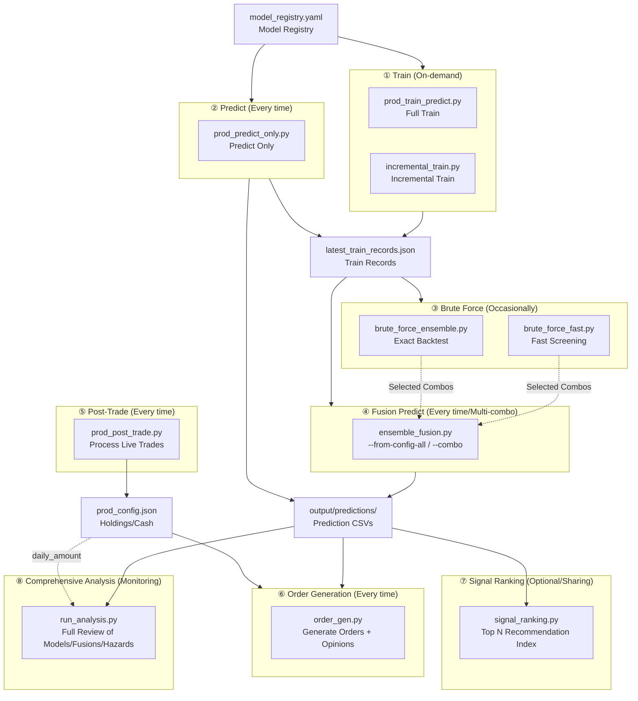

# QuantPits Quantitative Trading System Overview

## System Positioning

A **multi-frequency quantitative trading production system** (supporting weekly/daily) based on Qlib, adopting a "multi-model training → ensemble selection → fusion prediction → order generation" pipeline architecture.

---

## Workspace Architecture

The system strictly separates **Engine (Code)** from **Workspace (Data & Config)** to enable multi-instance parallelism:
- **Engine (`engine/`)**: Stores all globally shared core scripts (`scripts/`), analysis dashboards (`dashboard.py`), and system documentation (`docs/`).
- **Workspace (Directories under `workspaces/`)**: Any independent collection for live trading or simulation. Contains the instance-specific `config/`, `data/`, `output/`, and an isolated `mlruns/`.

**How to use workspaces?**
1. Create a new workspace: Use `python engine/scripts/init_workspace.py --source workspaces/A --target workspaces/B` for quick scaffolding.
2. Activate a workspace: Enter the system directory and run `source workspaces/<Your_Workspace>/run_env.sh` to set `QLIB_WORKSPACE_DIR`.
3. Execute scripts: Scripts will automatically route all file I/O into the currently activated workspace.

---

## Core Design Philosophy

Every step in this system is **optional and combinable**. Only "Prediction" and "Order Generation" are mandatory routine steps, while others are triggered as needed:

| Step | Required Every Time? | Description |
|------|:---:|------|
| ① Training | ⚠️ At least once | Mandatory for the first time; subsequently only when models need refreshing |
| ② Prediction | ✅ Every time | Can be produced along with training, or run independently with existing models |
| ③ Brute Force | ❌ Occasionally | Very time-consuming; a selected combo can be used for a long period |
| ④ Fusion Prediction | ✅ Every time | Supports multi-combo fusion and comparison; generates final fusion signals using selected combos |
| ⑤ Post-Trade | ✅ Every time | Processes last period's live data to update holdings and cash |
| ⑥ Order Generation | ✅ Every time | Generates buy/sell suggestions and multi-model opinions based on fused predictions and current holdings |
| ⑦ Signal Ranking | Optional | Normalizes scores into Top N rankings, suitable for sharing |

> [!IMPORTANT]
> Training is not required every time, but prediction is mandatory. Brute forcing combinations is a "heavy-duty" operation, and selected model combos can be used for a long time. The minimal routine operation loop is: **Prediction → Fusion → Post-Trade → Order Generation**.

---

## System Architecture



---

## Typical Execution Scenarios

⚠️ **All scenarios below must be executed in the system root directory (`QuantPits`) with the corresponding workspace activated beforehand.**
```bash
cd QuantPits
source workspaces/Demo_Workspace/run_env.sh
```

### Scenario A: Full Production Routine (Including Training)

Suitable for the first run or when models need to be refreshed.

```bash
# ① Full Training (Outputs predictions + training records)
python engine/scripts/prod_train_predict.py

# ③ Brute force combo search (Optional, very time-consuming)
python engine/scripts/brute_force_fast.py --max-combo-size 3

# ④ Fusion Prediction (Using chosen combo)
python engine/scripts/ensemble_fusion.py \
  --models gru,linear_Alpha158,alstm_Alpha158

# ⑤ Process last period's live trades
python engine/scripts/prod_post_trade.py

# ⑥ Generate this period's orders
python engine/scripts/order_gen.py
```

### Scenario B: Regular Routine (No Retraining, Minimal Loop)

Existing models are available; directly predict after data updates. **This is the most common production workflow.**

```bash
# ② Predict new data using existing models
python engine/scripts/prod_predict_only.py --all-enabled

# ④ Fusion Prediction (Multi-combo comparison)
python engine/scripts/ensemble_fusion.py --from-config-all

# ⑤ Process last period's live trades
python engine/scripts/prod_post_trade.py

# ⑥ Generate this period's orders
python engine/scripts/order_gen.py

# ⑦ Generate Signal Rankings (Optional, for sharing)
python engine/scripts/signal_ranking.py --all-combos

# ⑧ Run comprehensive system health analysis (Optional, for monitoring)
python engine/scripts/run_analysis.py \
  --models gru_Alpha158 transformer_Alpha360 TabNet_Alpha158 sfm_Alpha360
```

### Scenario C: Poor Fusion Performance, Fallback Retraining

When fusion prediction degrades, retrain specific models and re-evaluate.

```bash
# ① Incrementally train specific models
python engine/scripts/incremental_train.py --models gru,alstm_Alpha158

# ④ Refuse with the new models
python engine/scripts/ensemble_fusion.py \
  --models gru,linear_Alpha158,alstm_Alpha158

# ⑤⑥ Post-Trade + Order Gen (Same as Scenario B)
python engine/scripts/prod_post_trade.py
python engine/scripts/order_gen.py
```

### Scenario D: Re-evaluate Model Combinations

Re-run brute force periodically or when current combos are unsuitable.

```bash
# ② Predict using existing models (or automatically outputted after training)
python engine/scripts/prod_predict_only.py --all-enabled

# ③ Fast Brute Force Screening
python engine/scripts/brute_force_fast.py --max-combo-size 5

# ③ Exact backtesting on Top candidates for confirmation
python engine/scripts/brute_force_ensemble.py \
  --min-combo-size 3 --max-combo-size 3

# ④ Fuse using the newly selected combo
python engine/scripts/ensemble_fusion.py \
  --models <new_selected_combo>

# ⑤⑥ Post-Trade + Order Gen (As above)
```

---

## Module Cheat Sheet

### ① Training Module

> See details in [01_TRAINING_GUIDE.md](01_TRAINING_GUIDE.md)

| Script | Purpose | Save Semantics |
|------|------|----------|
| `prod_train_predict.py` | Full training of all enabled models | **Full Overwrite** of `latest_train_records.json` |
| `incremental_train.py` | Selective training by name/algo/tags | **Incremental Merge** to `latest_train_records.json` |

- Models are uniformly managed in `config/model_registry.yaml`
- Date parameters and frequency (`week`/`day`) are controlled by `config/model_config.json`
- Training records are auto-backed up to `data/history/` before modifying
- Incremental training supports `--resume` (resume from breakpoint) and `--dry-run` (preview)

### ② Prediction Module

> See details in [05_PREDICT_ONLY_GUIDE.md](05_PREDICT_ONLY_GUIDE.md)

| Script | Purpose |
|------|------|
| `prod_predict_only.py` | Predict on new data using existing models, no retraining |

- Loads models from `latest_train_records.json` and creates a new Recorder to save predictions
- Supports the same model selection methods as training scripts (by name/algo/tags)
- **Incremental Merge** to update `latest_train_records.json`, making downstream script switching seamless

### ③ Brute Force Module

> See details in [02_BRUTE_FORCE_GUIDE.md](02_BRUTE_FORCE_GUIDE.md)

| Script | Purpose | Speed |
|------|------|------|
| `brute_force_fast.py` | Vectorized fast screening | ~0.001s/combo |
| `brute_force_ensemble.py` | Full Qlib Backtesting | ~5s/combo |

- **Recommended Workflow**: Use the fast script to rough-screen all combos, then use the original script to accurately verify top candidates
- Outputs model attribution analysis, risk-return scatter plots, hierarchical clustering, etc.
- Supports `--resume` to continue running and `--analysis-only` for running analysis only

### ④ Fusion Prediction Module

> See details in [03_ENSEMBLE_FUSION_GUIDE.md](03_ENSEMBLE_FUSION_GUIDE.md)

| Script | Purpose |
|------|------|
| `ensemble_fusion.py` | Performs fusion + backtest + risk analysis on selected model combos |

- Supports multi-combo fusion: `--from-config-all` runs all combos at once, `--combo` specifies a single combo
- Multi-combo mode generates crossover comparison tables and net value comparison charts
- Weighting modes: `equal` / `icir_weighted` / `manual` / `dynamic`
- Outputs fused prediction CSV to `output/predictions/ensemble_*.csv`
- Config file: `config/ensemble_config.json` (Multi-combo structure, backwards compatible)

### ⑤ Post-Trade Module

> See details in [04_POST_TRADE_GUIDE.md](04_POST_TRADE_GUIDE.md)

| Script | Purpose |
|------|------|
| `prod_post_trade.py` | Processes live trading data to update holdings and cash |

- **Completely independent** of the training/predict/fusion modules
- Reads executed trade records from brokerage exported files (`.xlsx`)
- Supports multiple deposits/withdrawals by date (`config/cashflow.json`)
- Updates holdings and cash balances in `config/prod_config.json`

### ⑥ Order Generation Module

> See details in [06_ORDER_GEN_GUIDE.md](06_ORDER_GEN_GUIDE.md)

| Script | Purpose |
|------|------|
| `order_gen.py` | Generates buy/sell order CSVs based on predictions + current holdings |

- Supports three prediction sources: ensemble fusion (default) / single model / custom file
- **Multi-Model Opinion Table**: Auto-loads predictions from all combos and single models, generating BUY/SELL/HOLD judgments for each instrument
- Includes visualization script `plot_model_opinions.py` to generate multi-model ranking line charts
- Relies on holdings and cash in `prod_config.json` (from Post-Trade)
- TopK + DropN strategy dictates buy/sell/hold decisions

### ⑦ Signal Ranking Module

> See details in [07_SIGNAL_RANKING_GUIDE.md](07_SIGNAL_RANKING_GUIDE.md)

| Script | Purpose |
|------|------|
| `signal_ranking.py` | Normalizes fusion scores into recommendation indices and generates Top N rankings |

- Normalizes scores to a -100 ~ +100 recommendation index
- Supports generation by combo (`--all-combos` / `--combo`)
- Independent from order generation, suitable for distributing to others

---

## Data Flow

```text
┌─────────────────────────────────────────────────────────────────┐
│                      Configuration Layer                        │
│  model_registry.yaml    model_config.json    prod_config.json   │
│  cashflow.json          ensemble_config.json                    │
└────────────┬──────────────────┬──────────────────┬──────────────┘
             │                  │                  │
             ▼                  ▼                  ▼
┌──────────────────┐  ┌──────────────────┐  ┌──────────────────┐
│ Train / Predict  │  │ Live Trade       │  │ Deposits/        │
│                  │  │ Processing       │  │ Withdrawals      │
└────────┬─────────┘  └────────┬─────────┘  └────────┬─────────┘
         │                     │                     │
         ▼                     ▼                     ▼
latest_train_records.json   prod_config.json (Update Pos/Cash)
         │                             │
         ▼                             │
  ┌──────────────────┐                 │
  │ Brute Force (Opt)│                 │
  │ brute_force_*.py │                 │
  └────────┬─────────┘                 │
           │ Selected Combo            │
           ▼                           │
  ┌──────────────────┐                 │
  │ Ensemble Fusion  │                 │
  │ ensemble_fusion  │                 │
  └────────┬─────────┘                 │
           │ ensemble_*.csv            │
           ▼                           ▼
  ┌────────────────────────────────────────┐
  │ Order Generation                       │
  │ order_gen.py                           │
  │ Input: Predict CSV + Pos/Cash          │
  │ Output: buy/sell_suggestion_*.csv      │
  └────────────────────────────────────────┘
```

---

## Key Files Explanation

### Config Files (`config/`)

| File | Purpose | Related Module |
|------|------|----------|
| `model_registry.yaml` | Model Registry: Defines model names, algorithms, datasets, labels | Train, Predict |
| `model_config.json` | Date Params: Training windows, sliding/fixed mode | Train, Predict |
| `prod_config.json` | Live State: Current holdings, cash balance, processed date | Post-Trade, Order Gen |
| `cashflow.json` | Cashflow Records: Deposits/Withdrawals by date | Post-Trade |
| `ensemble_config.json` | Multi-combo Config: Combo definitions, weights, defaults | Fusion, Order Gen, Ranking |
| `workflow_config_*.yaml` | Qlib Workflows: Training configurations for each model | Train |

### Output Files (`output/`)

| Dir/File | Purpose |
|-----------|------|
| `predictions/*.csv` | Prediction results for models and ensembles (multi-combo includes combo name) |
| `brute_force/` | Exact brute force backtest results and analytical reports |
| `brute_force_fast/` | Fast brute force screening results |
| `ensemble/` | Fusion configs, leaderboards, charts, inter-combo comparisons |
| `ranking/` | Top N signal ranking CSVs |
| `model_opinions_*.csv/json` | Multi-model BUY/SELL/HOLD judgment tables |
| `model_opinions_*_linechart.png` | Multi-model ranking visualization charts |
| `buy/sell_suggestion_*.csv` | Target buy/sell execution orders |
| `model_performance_*.json` | Model IC/ICIR metrics |

### Running State (`data/`)

| File | Purpose |
|------|------|
| `history/` | Auto-backed up historical files |
| `order_history/` | Historical order suggestions, trade details, exported brokerage Excel files (supervised by archiver) |
| `run_state.json` | State tracker for incremental training (Resume functionality) |
| `trade_log_full.csv` | Cumulative trade log (both buys and sells) |
| `holding_log_full.csv` | Cumulative holdings log |
| `daily_amount_log_full.csv` | Daily capital summary |

### Archive Directory (`archive/`)

| Directory | Purpose |
|------|------|
| `output/` | Older output files (past versions of predictions, ensembles, brute forces) |

---

## Documentation Index

| ID | Document | Contents |
|:---:|------|------|
| 00 | [This Doc](00_SYSTEM_OVERVIEW.md) | System overview, architecture, typical scenarios, module cheat sheet |
| 01 | [TRAINING_GUIDE](01_TRAINING_GUIDE.md) | Full training, incremental training, model registry management |
| 02 | [BRUTE_FORCE_GUIDE](02_BRUTE_FORCE_GUIDE.md) | Brute force combo backtesting (Standard + Fast vectors) |
| 03 | [ENSEMBLE_FUSION_GUIDE](03_ENSEMBLE_FUSION_GUIDE.md) | Model fusion prediction, weighting schemes, tracking |
| 04 | [POST_TRADE_GUIDE](04_POST_TRADE_GUIDE.md) | Live trading data processing, holding/capital updates |
| 05 | [PREDICT_ONLY_GUIDE](05_PREDICT_ONLY_GUIDE.md) | Prediction only (no retrain), update train records |
| 06 | [ORDER_GEN_GUIDE](06_ORDER_GEN_GUIDE.md) | Order generation, outputting buy/sell suggestions |
| 07 | [SIGNAL_RANKING_GUIDE](07_SIGNAL_RANKING_GUIDE.md) | Top N signal recommendation |
| 08 | [ANALYSIS_GUIDE](08_ANALYSIS_GUIDE.md) | Single model quality, fusion correlations, slippage costs and comprehensive multi-factor risk assessments |

---

## Shared Utilities

`scripts/train_utils.py` provides shared capabilities for training and prediction modules:

- **Date Calculus**: Anchor date and window evaluations based on the Qlib calendar
- **YAML Injection**: Dynamically pushes date parameters into Qlib workflow config files
- **Model Registry**: Parses and filters `model_registry.yaml`
- **History Backups**: Automatically duplicates critical tables into `data/history/`
- **Record Merging**: Safely overwrites or merges data back into `latest_train_records.json`

### ⑧ File Archiving Tool

| Script | Purpose |
|------|------|
| `archive_dated_files.py` | Archives old dated output logs, retaining only the past N versions |

- Scans `output/` and `data/` for time-stamped files and groups them intuitively
- Trading data (suggestions, logs, excel files) is safely archived to `data/order_history/`
- Previous outputs migrated to `archive/output/`
- Supports `--dry-run`, `--keep N`, `--include-notebooks`, `--cleanup-legacy`
- **Routine use**: Just execute `python engine/scripts/archive_dated_files.py` post-run each period
- **Model Loading**: Interfaces gracefully with Qlib's native Recorder instances

---

## Decision Reference

### When is retraining necessary?

- Model prediction quality notably drops (IC/ICIR decay)
- Phenomenal shifts manifest across widespread market styles
- Entirely new models are registered which necessitate a first-time fit
- Need to validate results following massive hyperparameter optimizations

### When is brute-forcing configurations necessary?

- New models have been added or older ones removed
- Prediction characteristics drastically shift post-retraining
- Repeated underperformance sequentially over weeks
- Recommended routine reviews (e.g. at a monthly cadence)

### What is the minimal daily / weekly operation?

```bash
# Routine minimal loop (4 commands, assuming workspace is activated)
python engine/scripts/prod_predict_only.py --all-enabled     # Predict
python engine/scripts/ensemble_fusion.py --from-config-all       # Fuse
python engine/scripts/prod_post_trade.py                      # Post-Trade
python engine/scripts/order_gen.py                              # Generate Orders
```
