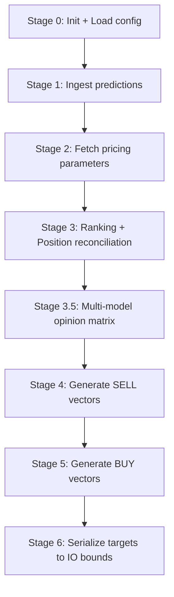

# Order Generation Guide

## Overview

`scripts/order_gen.py` is used to generate target buy/sell order suggestions based on ensemble fusion or single-model predictions.

**This script is the final step of the operational workflow.** It must be run after predictive data is available and actual post-trade conditions have been reconciled.

**Workflow Pipeline Placement**: Training → Brute Force → Fusion Backtest → Post-Trade → **Order Generation (This Step)**

| Script | Purpose |
|------|------|
| `order_gen.py` | Generates buy/sell suggestion CSV files natively dependent upon predictions + current holdings |

---

## Quick Start

```bash
cd QuantPits

# 1. Use default ensemble fused prediction (Most common operation)
python engine/scripts/order_gen.py

# 2. Use specific single-model prediction (Bypass fusion)
python engine/scripts/order_gen.py --model gru

# 3. Dry-run inspection (Exhibits mapping without writing serialization to disk)
python engine/scripts/order_gen.py --dry-run

# 4. Verbose outputs examining detailed ranks + multi-model opinions 
python engine/scripts/order_gen.py --verbose
```

---

## Predictive Data Sources

The processing pipeline prioritizes prediction sources via a hierarchical tier:

| Priority | Parameter | Source | Description |
|:---:|------|------|------|
| 1 | `--prediction-file` | Arbitrary CSV | Explicitly passes any prediction trajectory file |
| 2 | `--model` | Single Model CSV | Automatically locates newest version in `output/predictions/{model}_*.csv` |
| 3 | *(Default)* | Ensemble CSV | Prioritizes `ensemble_YYYY-MM-DD.csv` (default combo wrapper), fallback to `ensemble_default_*.csv`, then any `ensemble_*.csv` |

### Scenario 1: Nominal Routine Process

```bash
# Operate exclusively utilizing the gru prediction trace
python engine/scripts/order_gen.py --model gru

# Operate exclusively utilizing the lightgbm architecture
python engine/scripts/order_gen.py --model lightgbm_Alpha158
```

### Specifying Absolute Override File

```bash
python engine/scripts/order_gen.py --prediction-file output/predictions/ensemble_2026-02-06.csv
```

---

## Execution Logic



### Anchor Dates

The architecture automatically infers the **most recent previous trading day** according to the Qlib calendar interface, remaining chronologically synchronized with the explicit training parameters.

### Position Reconciliation Formula

1. Sort all active equities descending universally per `score`.
2. Determine Candidate Pool bounds utilizing `TopK + DropN × Buy Suggestion Factor`.
3. If natively held equities currently reside within the Candidate Pool → **HOLD**.
4. If natively held equities reside *outside* the Candidate Pool, extract the absolute worst `DropN` subset bounds → **SELL**.
5. Discovered equities residing within Candidate bounds currently unheld → **BUY (Candidate)**.

### Multi-Model Opinion Matrix (Stage 3.5)

**Feature**: Auto-loads prediction matrices encompassing all active combos alongside single models, aggregating them to deliver comprehensive BUY/SELL/HOLD judgment assessments targeting focus assets (Held + Candidate pools).

Decision Protocols (Matched identically to Stage 3 positioning):
- **order_basis**: Inherently operates using tracking parameters strictly derived from Stage 1 limits (price-merged); guarantees **100% equivalence** to actual triggered permutations.
- **combo_*/model_***: Simulates identically scoped swapping logic mapping individually.

Signal Flags:
- **HOLD**: Equities persisting inside bounds, or those outside boundaries bypassing the worst bounds `DropN`.
- **SELL**: Equities located strictly outside bounds encompassing exclusively the absolute worst positional `DropN`.
- **BUY**: Unheld targets riding topmost rankings bounded symmetrically targeting active Sell quantities.
- **BUY***: Unheld targets assigned strictly as alternates (Substitutes protecting against execution faults e.g. trade suspensions).
- **--**: Unheld components neglected entirely by Top parameters scaling.

Export Targets:
- `model_opinions_{date}.csv` — Matrix grid mapping asset rows dynamically across diverse algorithm opinion structures.
- `model_opinions_{date}.json` — Lexicon rendering combo matrices schemas + index component logic sets + legend mapping blocks.

Activate terminal monitoring mapping appending `--verbose`:
```bash
python engine/scripts/order_gen.py --verbose --dry-run
```

#### Visualizing Model Placements

Utilize `plot_model_opinions.py` yielding accelerated ranked line chart extrapolations targeting discrete assets arrayed sequentially across the algorithm framework mapping:
```bash
python engine/scripts/plot_model_opinions.py
# Natively auto-locates newest mapped artifacts, or explicit targeting: --input output/model_opinions_2026-02-24.csv
```

### Capital Mechanics

```text
Available Capital = Existing Balance + Estimated Sell Reclamation Proceeds + Inter-day Deposits
Lot Budget = Available Capital / Gross Buys Triggered
Bought Shares = floor(Lot Budget / Limit-Up Expected Bounds / 100) × 100
```

---

## Artifact Outcomes

```text
output/
├── sell_suggestion_{source}_{date}.csv       # Sell permutation targets
├── buy_suggestion_{source}_{date}.csv        # Buy permutation allocations
├── model_opinions_{date}.csv                 # Aggregated prediction multi-matrix
└── model_opinions_{date}.json                # Matrix component schemas
```

(`{source}` scales dynamically mapping toward `ensemble`, active algorithm parameters `gru`, or explicit `custom` flags.)

### Order Trajectories

| Field | Meaning |
|------|------|
| `instrument` | Asset code identifier |
| `datetime` | Target operational mapping date |
| `value` | Share count quantity |
| `estimated_amount` | Capital proxy boundary approximations |
| `score` | Native prediction index evaluation |
| `current_close` | Adjusted prevailing closing evaluation price vector |

### Multi-Model Map Columns

| Identity | Schema Reference |
|------|------|
| `instrument` | Matrix indexing asset vectors |
| `order_basis` | Unbiased decision mapping tracking generated action targets perfectly |
| `combo_{name}` | Standalone combo prediction logic trace mappings |
| `model_{name}` | Standalone explicit prediction components tracing bounds |

---

## Complete Parameter Reference

```text
python engine/scripts/order_gen.py --help

Optional Overrides:
  --model TEXT             Utilize explicitly defined algorithm (Bypass fusing mechanics)
  --prediction-file TEXT   Explicit CSV trace overrides targeting external sources
  --output-dir TEXT        Output targets (Default output)
  --dry-run               Terminal outputs solely bypassing file execution
  --verbose               Activate heavy debug/trace components exhibiting rank lists
```

---

## Core Dependencies

> [!IMPORTANT]
> The engine mandates adherence strictly following:
> 1. Accessible `.csv` vectors inside `output/predictions/` tracing upstream generator algorithms (Fusion/Prediction mappings).
> 2. Synchronized array variables referencing native parameters scaling inside `config/prod_config.json` denoting absolute capital + asset boundaries explicitly synced (Managed via `post-trade`).

> [!TIP]
> Executing `--dry-run --verbose` is heavily advocated preventing critical misallocations prior to actual execution orders mapping.
